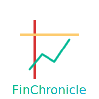

# Logo & Branding Improvement Plan

**Current Status:** Branding inconsistency detected
**Issue:** Header uses wallet icon, PWA uses custom logo
**Goal:** Unified, professional brand identity

---

## 🔍 Current Branding Audit

### What You Have

**1. App Header (Visible in App):**
```html
<i class="ri-wallet-3-line"></i> FinChronicle
```
- **Icon:** Generic wallet (from Remix Icon library)
- **Wordmark:** "FinChronicle" in system font
- **What users see:** 💼 FinChronicle

**2. PWA Icon (icons/icon.svg):**
- **Design:** Ledger book with ascending line chart
- **Colors:** White book, red spine, yellow line, green chart
- **What it represents:** Financial tracking + growth
- **Quality:** Professional, custom-designed ✅

**3. Branding Mismatch:**
- ⚠️ Header icon (wallet) ≠ PWA icon (book + chart)
- ⚠️ Inconsistent brand identity
- ⚠️ Users see different logos in different places

---

## ✅ Recommended Solution

### **Option 1: Use Your Existing Logo Consistently** ⭐ (Easiest)

**What to do:**
Replace the wallet icon with your custom logo SVG

**Implementation:**
```html
<!-- BEFORE (current) -->
<h1><i class="ri-wallet-3-line"></i> FinChronicle</h1>

<!-- AFTER (consistent) -->
<h1>
  
  <span>FinChronicle</span>
</h1>
```

**CSS:**
```css
.app-logo {
  width: 32px;
  height: 32px;
  display: inline-block;
  vertical-align: middle;
  margin-right: 8px;
}
```

**Benefits:**
- ✅ Consistent branding (same logo everywhere)
- ✅ Professional (your custom design is good!)
- ✅ Zero cost (use existing asset)
- ✅ 10 minutes to implement

**Effort:** 10 minutes

---

### **Option 2: Redesign Everything** (Best Quality)

**What to do:**
Create new logo that represents FinChronicle better

**Process:**
1. **Design new logo** (3-5 hours or $50-100 outsourced)
2. **Export all sizes** (192, 512, maskable, favicon)
3. **Update header** (use new logo image)
4. **Update all icon files**
5. **Update manifest.json**
6. **Test across devices**

**Concepts to Consider:**

**Concept A: "Chronicle Book + Chart"** (Modern)
```
📖 + 📈 = Your existing logo (good!)
Just refine the colors to match your brand
```

**Concept B: "FC Monogram"** (Minimal)
```
Stylized F + C letters
Forms abstract coin or chart shape
Modern, bold, memorable
```

**Concept C: "Timeline + Coins"** (Metaphorical)
```
Coins stacked on timeline
Represents money over time
Simple, clear, finance-focused
```

**My Recommendation:** Your existing logo is actually good! Just needs color adjustment.

**Effort:** 3-5 hours (DIY) or $50-100 (outsourced)

---

### **Option 3: Simplified Icon-Only** (Quickest)

**What to do:**
Extract just the chart from your SVG, make it the logo

**Implementation:**
1. Open `icons/icon.svg` in Figma
2. Remove book background, keep only chart line
3. Make chart your primary blue (#0051D5)
4. Use as logo

**Visual:**
```
Before: 📖📈 (book + chart)
After:  📈  (chart only, cleaner)
```

**Benefits:**
- ✅ Minimal and modern
- ✅ Quick to create (1 hour)
- ✅ Uses your brand color
- ✅ Still recognizable

**Effort:** 1 hour

---

## 🎨 Step-by-Step: Use Existing Logo in Header

### Implementation (10 minutes)

#### Step 1: Update index.html

**Find line ~250:**
```html
<h1><i class="ri-wallet-3-line"></i> FinChronicle</h1>
```

**Replace with:**
```html
<h1>
  
  <span>FinChronicle</span>
</h1>
```

#### Step 2: Add CSS (styles.css)

**Add after header styles (around line 300):**
```css
.app-logo {
  width: 32px;
  height: 32px;
  display: inline-block;
  vertical-align: middle;
  margin-right: var(--space-sm);
  flex-shrink: 0;
}

/* Make logo slightly smaller on mobile */
@media (max-width: 480px) {
  .app-logo {
    width: 28px;
    height: 28px;
  }
}
```

#### Step 3: Test

```bash
# Open app
open http://localhost:8000

# Verify:
- Logo appears in header
- Logo scales correctly
- Logo works in dark mode
- Logo doesn't break layout
```

**Done!** Consistent branding in 10 minutes.

---

## 🎨 Option: Refine Your Existing Logo

### Issues with Current icon.svg

**Good:**
- ✅ Concept is great (book + chart = financial chronicle)
- ✅ Professional execution
- ✅ Unique and memorable

**Could Improve:**
- ⚠️ Too many colors (green, red, yellow, gradient)
- ⚠️ Doesn't match app color scheme (#0051D5)
- ⚠️ Complex for small sizes
- ⚠️ Text in logo (doesn't scale down well)

### Recommended Refinements

**Simplify Color Palette:**
- Remove: Red, yellow, green gradient
- Keep: Primary blue (#0051D5), white, optional accent

**Simplify Design:**
- Remove: Text at bottom ("FinChronicle")
- Simplify: Book background (just outline or solid blue)
- Emphasize: Chart line (your key visual)

**New Design Direction:**
```svg
<!-- Simplified version -->
<svg viewBox="0 0 200 200">
  <!-- Blue rounded square background -->
  <rect x="30" y="30" width="140" height="140" rx="20" fill="#0051D5"/>

  <!-- White ascending chart line -->
  <polyline points="50,150 75,120 100,130 130,80 150,70"
            fill="none"
            stroke="#FFFFFF"
            stroke-width="8"
            stroke-linecap="round"/>

  <!-- Optional: Small dots at data points -->
  <circle cx="50" cy="150" r="4" fill="#FFFFFF"/>
  <circle cx="75" cy="120" r="4" fill="#FFFFFF"/>
  <circle cx="100" cy="130" r="4" fill="#FFFFFF"/>
  <circle cx="130" cy="80" r="4" fill="#FFFFFF"/>
  <circle cx="150" cy="70" r="6" fill="#34c759"/> <!-- Green final point = growth -->
</svg>
```

**Result:**
- Clean, minimal chart on blue background
- Represents financial tracking + growth
- Uses your brand colors
- Scales beautifully from 16px to 512px

**Effort:** 2 hours in Figma

---

## 🛠️ DIY Logo Creation (Step-by-Step)

### Using Figma (Free, Recommended)

**Time:** 2-3 hours total

#### Phase 1: Setup (15 min)

1. Go to https://figma.com
2. Sign up (free account)
3. Create new file: "FinChronicle Logo"
4. Create frame: 512×512 px (for PWA icon)

#### Phase 2: Design (1-2 hours)

**Logo Concept: Minimal Chart**

1. **Background:**
   - Rectangle tool (R key)
   - Size: 512×512 px
   - Corner radius: 80px (rounded square)
   - Fill: #0051D5 (your primary blue)

2. **Chart Line:**
   - Pen tool (P key) or Line tool
   - Draw ascending line with 4-5 points
   - Stroke: 20px width
   - Color: #FFFFFF (white)
   - Style: Rounded caps

3. **Optional Accents:**
   - Add small circles at data points (Circle tool)
   - Last point: Green (#34c759) for growth
   - Or add subtle grid lines in background

4. **Export:**
   - Select frame
   - Export → SVG (for vector)
   - Export → PNG 512×512 (for PWA)
   - Export → PNG 192×192 (for PWA)

#### Phase 3: Generate Variations (30 min)

**Maskable Icon:**
- Add 40px padding (safe zone for Android)
- Ensure icon content within center circle

**Favicon:**
- Simplify further (remove small details)
- Export 32×32, 16×16

**Dark Mode:**
- Invert: Blue background → Dark (#1c1c1e)
- Keep chart white or use blue (#0A84FF)

---

## 🎨 Quick Win: Update Current Logo Colors

### Easiest Option: Recolor Existing SVG (30 min)

**Edit icons/icon.svg:**

**Change colors to match your brand:**
```svg
<!-- BEFORE (current colors) -->
<linearGradient id="textGradient">
  <stop offset="0%" stop-color="#00b894"/>  <!-- Teal -->
  <stop offset="100%" stop-color="#11adeb"/> <!-- Light blue -->
</linearGradient>
<line stroke="#d63031"/>  <!-- Red spine -->
<line stroke="#fdcb6e"/>  <!-- Yellow line -->
<polyline stroke="#00b894"/>  <!-- Teal chart -->

<!-- AFTER (brand colors) -->
<linearGradient id="textGradient">
  <stop offset="0%" stop-color="#0051D5"/>  <!-- Your blue -->
  <stop offset="100%" stop-color="#0A84FF"/> <!-- Lighter blue -->
</linearGradient>
<line stroke="#0051D5"/>  <!-- Blue spine -->
<line stroke="#FFFFFF"/>  <!-- White line (cleaner) -->
<polyline stroke="#34c759"/>  <!-- Your green (success) -->
```

**Result:**
- Logo matches app color scheme
- More cohesive brand identity
- Still uses your existing design

**Effort:** 30 minutes (edit SVG in text editor or Figma)

---

## 📦 Complete Branding Package

### What You Need for Professional Branding

**1. Logo Assets:**
- [ ] Primary logo (full color, SVG)
- [ ] Logo icon-only (square, 512×512)
- [ ] Logo dark mode version
- [ ] Logo monochrome (black/white)
- [ ] Logo variations (horizontal, stacked, icon-only)

**2. PWA Icons:**
- [ ] icon-192.png (192×192, standard)
- [ ] icon-512.png (512×512, splash screen)
- [ ] maskable-icon-512.png (safe zone for Android)
- [ ] apple-touch-icon.png (180×180, iOS)
- [ ] favicon.ico (16×16, 32×32, browser)

**3. Brand Guidelines:**
- [ ] Color palette (with hex codes)
- [ ] Typography (font family, sizes, weights)
- [ ] Logo usage rules (minimum size, spacing, don'ts)
- [ ] Icon library (what icons to use)

**4. Marketing Assets (Optional):**
- [ ] Social media cover (1200×630 for og:image)
- [ ] App screenshots (for GitHub, stores)
- [ ] Promotional graphics

---

## 🎯 My Recommendation FOR YOU

### **Quick Win (30 minutes):**

**1. Use Existing Logo in Header (10 min)**
- Replace wallet icon with your custom SVG logo
- Matches PWA icon
- Instant brand consistency

**2. Recolor SVG to Match Brand (20 min)**
- Change green/red/yellow to your blue/green
- Edit icon.svg in text editor
- Re-export PNGs

**Result:** Professional, consistent branding in 30 minutes ✅

---

### **Comprehensive Rebrand (3-5 hours or $100):**

**DIY Path:**
1. Design new logo in Figma (2-3 hours)
2. Export all sizes (30 min)
3. Update app header (10 min)
4. Update all icon files (30 min)
5. Create brand guidelines doc (1 hour)

**Outsourced Path:**
1. Post on Fiverr ($50-100)
2. Provide design brief (15 min)
3. Receive files (3-7 days)
4. Update app (30 min)

---

## 🚀 Implementation Steps (Choose One)

### **Path A: Quick Fix** (30 min) ⭐ Recommended

```bash
# 1. Update header to use custom logo
# Edit index.html line ~250:
<h1>
  
  <span>FinChronicle</span>
</h1>

# 2. Add CSS for logo
# Edit css/styles.css
.app-logo {
  width: 32px;
  height: 32px;
  margin-right: 8px;
}

# 3. Optional: Recolor icon.svg
# Edit icons/icon.svg - change colors to #0051D5

# 4. Test
open http://localhost:8000

# 5. Commit
git add index.html css/styles.css icons/icon.svg
git commit -m "feat: use custom logo in app header for brand consistency"
```

**Result:** Brand consistency achieved ✅

---

### **Path B: Professional Redesign** (Fiverr)

**1. Create Design Brief:**
```
Project: FinChronicle Logo Design

About the App:
- Personal finance tracking PWA
- Privacy-first, offline-first
- Tracks income, expenses, insights
- Target users: Casual budgeters

Brand Personality:
- Trustworthy, simple, empowering
- Modern, minimal, clean

Design Requirements:
- App icon (512×512, PWA)
- Favicon (16×16, 32×32)
- Maskable icon (512×512 with safe zone)
- SVG vector version
- Works in monochrome
- Represents: Financial tracking + time/chronicle

Color Palette:
- Primary: #0051D5 (blue)
- Accent: #34c759 (green)
- Background: White

Deliverables:
- SVG (vector)
- PNG (192, 512)
- Maskable PNG (512)
- Favicon (ICO)
- Source file (Figma/AI)

Budget: $50-100
Timeline: 3-7 days
```

**2. Post on Fiverr:**
- Search "app logo design"
- Filter: 4.5+ stars, $50-100 range
- Check portfolio for finance/fintech work
- Order and provide brief

**3. Receive Files:**
- Review designs
- Request revisions (usually 2-3 included)
- Download final files

**4. Implement:**
- Replace icon files
- Update header
- Test

**Total:** $75 + 1 hour implementation

---

### **Path C: DIY in Figma** (2-3 hours)

**Tutorial:**

1. **Open Figma → New File**

2. **Create Frame (512×512)**

3. **Design "Ascending Bars" Logo:**
   ```
   ┌──────────────┐
   │  ▃ ▅ ▇ █    │  ← 4 bars, ascending
   │  Your Logo   │  ← Clean, minimal
   └──────────────┘
   ```

   - Rectangle tool: Create 4 bars
   - Heights: 100px, 150px, 200px, 250px
   - Width: 60px each
   - Spacing: 20px between
   - Color: White (#FFFFFF)
   - Background: Blue rounded square (#0051D5, radius 80px)

4. **Export:**
   - Frame → Export → PNG (512×512)
   - Frame → Export → SVG
   - Create maskable version (add 40px padding)
   - Create favicon (simplify, export 32×32)

5. **Implement:**
   - Replace files in `icons/` folder
   - Update header
   - Test

**Video Tutorial:** Search YouTube "Figma app icon tutorial"

---

## 🎯 My Specific Recommendation

### **Do This NOW (30 minutes):**

**1. Use your existing logo in header (10 min)** ✅
- Fixes brand inconsistency
- Professional immediately
- Zero cost

**2. Recolor icon.svg to match brand (20 min)** ✅
- Change teal/red/yellow to blue/green/white
- Better color harmony
- Matches app theme

**Total:** 30 minutes, professional result

### **Do This LATER (v4.0+):**

**If you want even better branding:**
- Hire designer on Fiverr ($75-100)
- Get professional, unique logo
- Complete brand package

**But honestly:** Your current logo (book + chart) is already good! Just needs:
1. Consistent usage (header + PWA)
2. Color adjustment (match brand)

---

## 📐 Logo Best Practices

### What Makes a Good App Logo

**1. Simple**
- Works at 16×16 pixels
- Recognizable instantly
- Not too many details

**2. Memorable**
- Unique shape or concept
- Not generic
- Sticks in user's mind

**3. Relevant**
- Represents the app's purpose
- Finance + Time + Tracking

**4. Scalable**
- Vector-based (SVG)
- Works from tiny to huge
- Maintains clarity

**5. Versatile**
- Works in color and monochrome
- Works on light and dark backgrounds
- Works as icon-only (no text)

### Examples of Great Finance Logos

**Mint:** Green circle with "M" - simple, memorable
**YNAB:** Bold "YNAB" with speech bubble - unique shape
**Splitwise:** Two arrows forming "S" - clever, minimal
**Wallet:** Abstract wallet shape - relevant, simple

**FinChronicle should be:** Recognizable chart/growth symbol in your brand blue

---

## 🎨 Color Psychology for Finance Apps

### Why Blue Works

**Blue = Trust, Security, Stability**
- Used by: Chase, American Express, PayPal, Venmo
- Psychology: Calming, professional, reliable
- Your choice (#0051D5) is perfect ✅

### Accent Colors

**Green = Growth, Success, Positive**
- Your current: #34c759 ✅
- Used for: Income, savings, positive trends
- Works great with blue

**Red = Expenses, Alerts, Caution**
- Your current: #ff3b30 ✅
- Used for: Expenses, warnings, delete actions
- Good contrast with blue

**Your color palette is already excellent!** Just make sure logo uses it.

---

## 📊 Brand Consistency Checklist

### Current Brand Elements

**Colors:**
- ✅ Primary: #0051D5 (blue)
- ✅ Success: #34c759 (green)
- ✅ Danger: #ff3b30 (red)
- ✅ Background: #f5f5f7 (light gray)

**Typography:**
- ✅ System fonts (SF Pro, Segoe UI)
- ✅ Mono for numbers (good for finance!)

**Icons:**
- ✅ Remix Icon library (consistent style)

**Spacing:**
- ✅ Design tokens (--space-sm, --space-md, etc.)

**What's Inconsistent:**
- ❌ Header uses wallet icon
- ❌ PWA uses book + chart logo
- ❌ Icon.svg colors don't match brand palette

**Fix:** Use consistent logo + recolor to brand palette

---

## ✅ Action Plan

### Today (30 min)
1. [ ] Replace wallet icon with custom logo in header
2. [ ] Add .app-logo CSS class
3. [ ] Test in browser
4. [ ] Commit "feat: use custom logo for brand consistency"

### This Week (Optional)
1. [ ] Recolor icon.svg to match brand (#0051D5)
2. [ ] Re-export PNG files
3. [ ] Update maskable icon
4. [ ] Test on mobile (install as PWA)

### Future (Optional)
1. [ ] Hire designer for professional rebrand ($75-100)
2. [ ] Create complete brand guidelines
3. [ ] Add social media graphics

---

## 🎯 Bottom Line

**Your Question:** "How can we get a good logo?"

**My Answer:**

**You already have a good logo!** (book + chart in icon.svg)

**Just need to:**
1. ✅ **Use it consistently** (header + PWA) - 10 min
2. ✅ **Recolor to match brand** (blue instead of teal/red) - 20 min

**That's it!** 30 minutes to professional branding.

**Only hire a designer if:**
- You want something completely different
- You have budget ($75-100)
- You want premium quality

But honestly, your current logo concept is solid. Just needs consistency and color adjustment.

---

## 🚀 Quick Start

**Want me to help you implement the quick fix?**

I can update:
1. index.html (use logo in header)
2. css/styles.css (add logo styles)
3. icons/icon.svg (recolor to brand)

**Takes 10 minutes, then you test and commit!**

**Ready to do it?** 🎨
