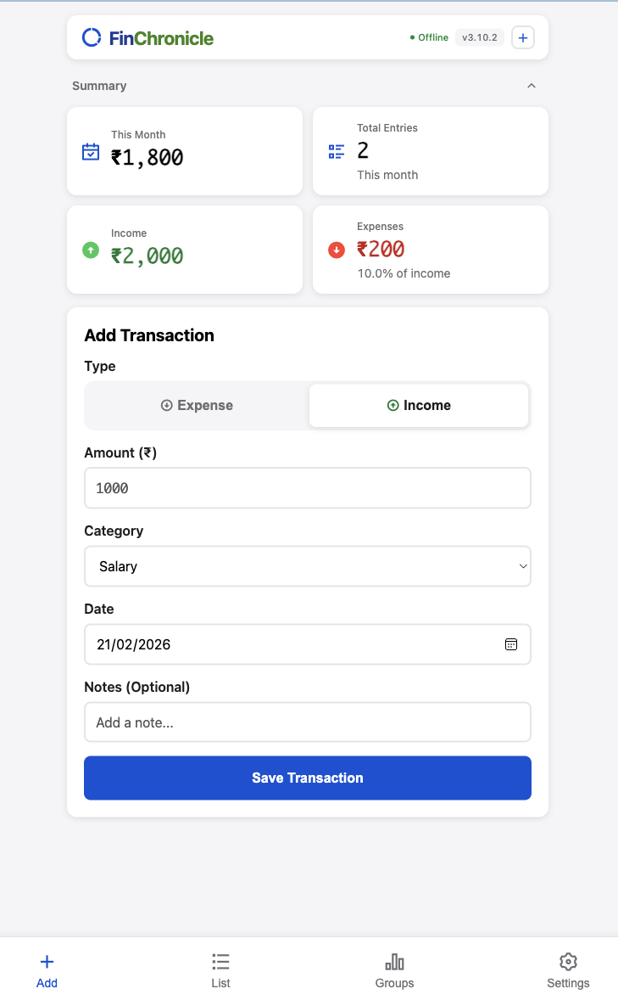
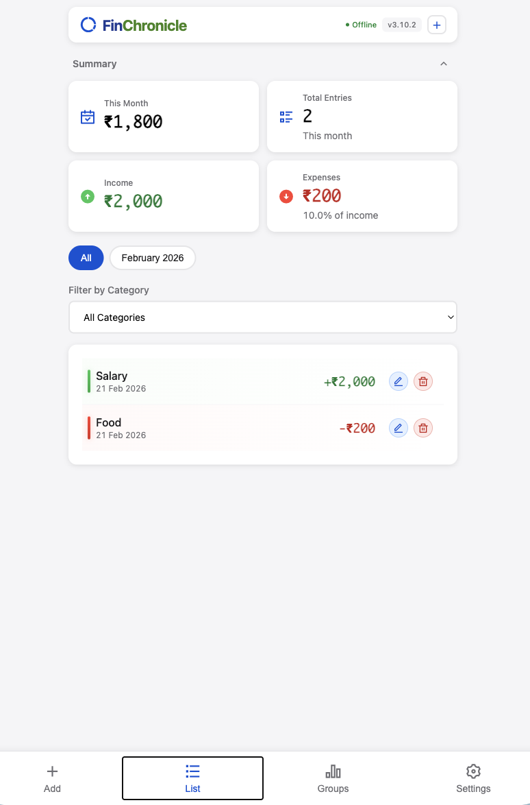
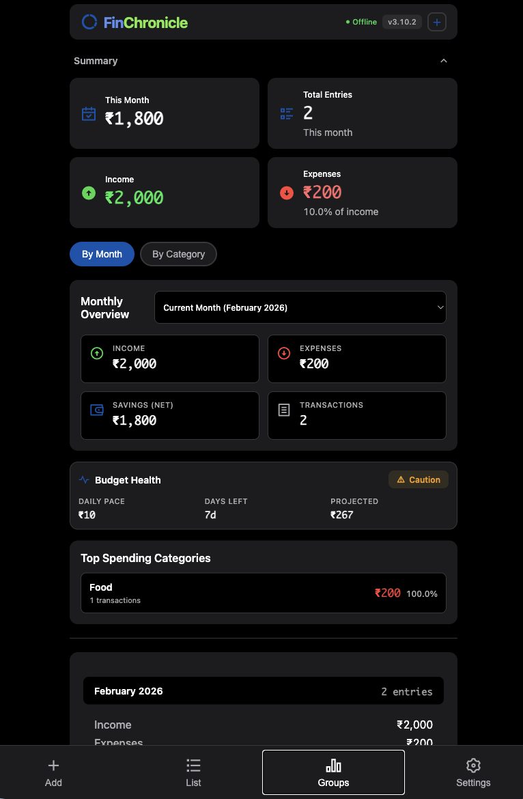

# 📖 FinChronicle

> A beautiful, offline-first Progressive Web App for chronicling your financial journey. No sign-up, no ads, no tracking - just simple expense and income management. Built by Kiren Labs.

[](https://opensource.org/licenses/MIT)
[](CONTRIBUTING.md)
[](VERSION.md)
[](CODE_OF_CONDUCT.md)
[](SECURITY.md)

**[Live Demo](https://kiren-labs.github.io/finchronicle/)** | **[Documentation](VERSION.md)** | **[Contributing](CONTRIBUTING.md)** | **[Security](SECURITY.md)**

---

## 📱 Screenshots

<div align="center">
  
  
  
  
</div>

---

## ✨ Features

### 🎯 Core Features
- ✅ **100% Offline** - Works without internet connection
- ✅ **Privacy First** - All data stays on your device
- ✅ **No Sign-Up** - Start using immediately
- ✅ **Installable** - Add to home screen like a native app
- ✅ **Fast & Lightweight** - Only ~15KB total size
- ✅ **Dark Mode** - Easy on the eyes at night

### 💰 Financial Tracking
- ✅ **Income & Expenses** - Track both transaction types
- ✅ **Categories** - Organize by customizable categories
- ✅ **Multi-Currency** - Support for 20 major currencies
- ✅ **Monthly Reports** - View income/expense summaries
- ✅ **Category Insights** - See spending by category
- ✅ **Export to CSV** - Backup and analyze your data

### 🎨 User Experience
- ✅ **Smart Type Toggle** - Mobile-friendly income/expense selection
- ✅ **Dynamic Categories** - Categories filter based on type
- ✅ **Edit & Delete** - Manage transactions easily
- ✅ **Month Filtering** - View specific time periods
- ✅ **Auto-Updates** - Get notified of new versions
- ✅ **Modern Icons** - Professional Remix Icon font

### 🛠️ Technical Features
- ✅ **Service Worker** - Offline caching
- ✅ **IndexedDB** - Robust transaction data storage
- ✅ **localStorage** - Settings persistence
- ✅ **Responsive Design** - Works on all screen sizes
- ✅ **WCAG AA Compliant** - Fully accessible
- ✅ **Version Management** - Semantic versioning with auto-update

---

## 🚀 Quick Start

### Option 1: Use the Hosted Version

1. Visit: **[https://kiren-labs.github.io/finchronicle/](https://kiren-labs.github.io/finchronicle/)**
2. On mobile, tap **Share** → **Add to Home Screen**
3. Start tracking your finances!

### Option 2: Self-Host (5 Minutes)

#### Using GitHub Pages

1. Fork this repository
2. Go to Settings → Pages
3. Source: Deploy from branch `main`
4. Your app will be at: `https://kiren-labs.github.io/finchronicle`

#### Using Local Server

```bash
# Clone the repository
git clone https://github.com/kiren-labs/finchronicle.git
cd finchronicle

# Start local server
python3 -m http.server 8000

# Open in browser
open http://localhost:8000
```

**Note:** Service Worker requires HTTP/HTTPS. Don't open `index.html` directly!

---

## 💻 Development

### Prerequisites

- Any modern web browser
- A local web server (for testing service worker)
- Text editor (VS Code, Sublime, etc.)

### Project Structure

```
finchronicle/
├── index.html          # Main HTML structure
├── app.js             # Application logic (~2650 lines)
├── sw.js              # Service Worker for offline support
├── manifest.json      # PWA manifest
├── css/
│   ├── tokens.css     # Design tokens
│   ├── styles.css     # Main styles
│   └── dark-mode.css  # Dark theme
├── icons/             # PWA icons
├── robots.txt         # SEO configuration
├── README.md          # This file
├── CONTRIBUTING.md    # Contribution guidelines
├── LICENSE            # MIT License
├── VERSION.md         # Version history and guide
└── CHANGELOG.md       # Detailed changelog
```

### Making Changes

1. **Edit files**:
   - `app.js` for application logic and features
   - `index.html` for HTML structure
   - `css/styles.css` for styling
2. **Update version** in three places:
   ```javascript
   // app.js (line 2)
   const APP_VERSION = '3.10.3';

   // sw.js (line 4)
   const CACHE_NAME = 'finchronicle-v3.10.3';
   ```
   ```json
   // manifest.json
   "version": "3.10.3"
   ```
3. **Test locally**:
   ```bash
   python3 -m http.server 8000
   ```
4. **Update** `CHANGELOG.md` with your changes
5. **Commit and push**

### Customization

#### Change Currency

Click the currency button in the toolbar and select from 20+ currencies!

Or modify the default in [app.js](app.js):
```javascript
// In app.js, search for getCurrency() function:
function getCurrency() {
    const saved = localStorage.getItem('currency');
    return saved && currencies[saved] ? saved : 'INR'; // Change to your default
}
```

#### Add Categories

```javascript
// In app.js, search for categories object:
const categories = {
    income: [
        'Salary',
        'Business',
        'Investment',
        'Your New Category', // Add here
        'Other Income'
    ],
    expense: [
        'Food',
        'Groceries',
        'Transport',
        'Your New Category', // Add here
        'Other Expense'
    ]
};
```

#### Change Theme Colors

```css
/* In css/tokens.css: */
--color-primary: #0051D5;     /* Blue - main app color */
--color-success: #34c759;     /* Green - income */
--color-danger: #ff3b30;      /* Red - expense */
--color-bg: #f5f5f7;          /* Light mode background */
--color-surface: #ffffff;     /* Card background */
```

---

## 📊 Supported Currencies

20 major currencies supported:

**Americas**: USD ($), CAD (C$)
**Europe**: EUR (€), GBP (£), CHF (Fr)
**Asia**: INR (₹), JPY (¥), CNY (¥), THB (฿), SGD (S$), HKD (HK$), KRW (₩), MYR (RM), PHP (₱), IDR (Rp), VND (₫)
**Middle East**: AED (د.إ), SAR (SR)
**Oceania**: AUD (A$), NZD (NZ$)

---

## 🔒 Privacy & Security

### Your Data
- ✅ Stored **locally** on your device only
- ✅ **Never sent** to any server
- ✅ **No tracking** or analytics
- ✅ **No accounts** or sign-up required
- ✅ **No ads** or monetization

### What We Collect
- ❌ **Nothing!** This app collects zero data.

### Data Access
- Only you can access your data
- Transaction data stays in your browser's IndexedDB
- Settings stay in your browser's localStorage
- Even we (the developers) can't see your data

---

## 🛣️ Roadmap

### Recently Completed (v3.x)
- ✅ Import from CSV / Backup & Restore
- ✅ Budget Health Tracking
- ✅ Month-over-month trends
- ✅ Advanced filtering
- ✅ Transaction validation layer
- ✅ Enhanced export with metadata

### Upcoming Features
- [ ] Recurring transactions
- [ ] Search functionality
- [ ] Custom categories
- [ ] Charts and graphs
- [ ] Tag system
- [ ] Custom date ranges

See [FEATURE-ROADMAP.md](docs/FEATURE-ROADMAP.md) for detailed roadmap.

---

## 🤝 Contributing

We love contributions! Whether it's:

- 🐛 Bug reports
- 💡 Feature requests
- 📝 Documentation improvements
- 🔧 Code contributions

See [CONTRIBUTING.md](CONTRIBUTING.md) for guidelines.

### Quick Contribution Guide

1. Fork the repository
2. Create your feature branch: `git checkout -b feature/AmazingFeature`
3. Commit your changes: `git commit -m 'Add some AmazingFeature'`
4. Push to the branch: `git push origin feature/AmazingFeature`
5. Open a Pull Request

---

## 📈 Stats

- **Size**: ~15KB (total app)
- **Dependencies**: 1 (Remix Icon font - CDN)
- **Performance**: 100/100 Lighthouse score
- **Accessibility**: WCAG AA compliant
- **PWA Score**: Fully installable

---

## 🌟 Why This App?

### vs Mint / YNAB
- ✅ Free forever (no subscription)
- ✅ No sign-up required
- ✅ Complete privacy (data stays local)
- ✅ Works 100% offline
- ❌ No bank integration

### vs Spreadsheets
- ✅ Easier to use on mobile
- ✅ Offline-first mobile app
- ✅ Quick transaction entry
- ✅ Built-in insights
- ✅ Can export to CSV anytime

### vs Other PWAs
- ✅ Ultra lightweight (~15KB)
- ✅ True offline-first (no internet needed)
- ✅ Open source
- ✅ No vendor lock-in

---

## 🐛 Bug Reports

Found a bug? Please [open an issue](https://github.com/kiren-labs/finchronicle/issues/new) with:

- Browser and OS version
- Steps to reproduce
- Expected vs actual behavior
- Screenshots (if applicable)

---

## 📄 License

This project is licensed under the **MIT License** - see the [LICENSE](LICENSE) file for details.

**TL;DR**: You can use, modify, and distribute this app freely. Just keep the original copyright notice.

---

## 🙏 Acknowledgments

- **Icons**: [Remix Icon](https://remixicon.com/) - Beautiful icon set
- **Inspiration**: Built with love for simple, privacy-focused finance tracking
- **Community**: Thanks to all contributors!

---

## 📞 Support

- **Documentation**: [VERSION.md](VERSION.md)
- **Issues**: [GitHub Issues](https://github.com/kiren-labs/finchronicle/issues)
- **Discussions**: [GitHub Discussions](https://github.com/kiren-labs/finchronicle/discussions)

---

## ⭐ Show Your Support

If this project helped you, please consider:
- ⭐ Starring the repository
- 🐦 Sharing on social media
- 🤝 Contributing improvements
- 📝 Writing a blog post about it

---

## 📜 Changelog

See [CHANGELOG.md](CHANGELOG.md) for detailed version history.

**Latest Release: v3.10.3**
- 🔒 Transaction validation layer (amounts, dates, categories)
- 💾 Enhanced backup system with metadata
- 📊 Month-over-month trend indicators
- 🎯 Budget health tracking
- ⚡ Performance optimizations
- 🐛 Various bug fixes

---

<div align="center">

**Made with ❤️ for simple, private finance tracking**

[Report Bug](https://github.com/kiren-labs/finchronicle/issues) · [Request Feature](https://github.com/kiren-labs/finchronicle/issues) · [Contribute](CONTRIBUTING.md)

</div>
